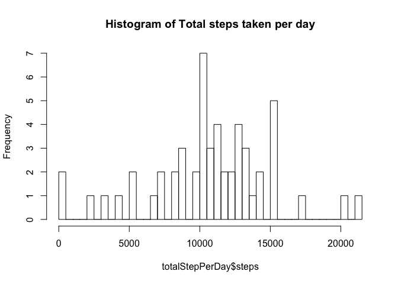
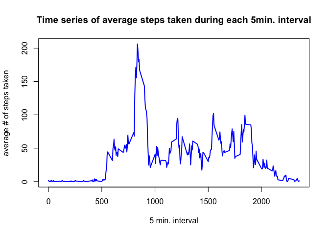
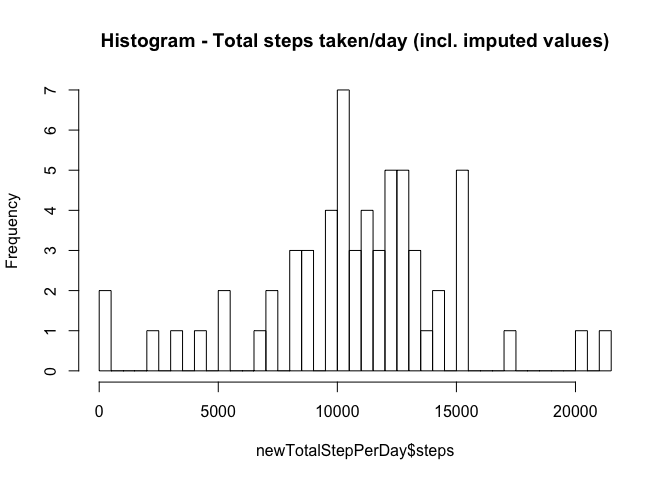
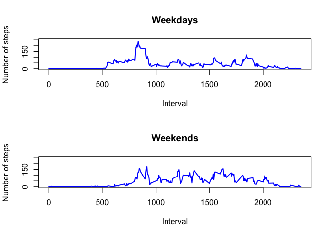

# Reproducible Research: Peer Assessment 1
### Author: Miguel López


## Loading and preprocessing the data
First lets download the data, uzip it and put it in a variable **data**


```r
temp <- tempfile()
download.file("https://d396qusza40orc.cloudfront.net/repdata%2Fdata%2Factivity.zip",temp)
data <- read.csv(unz(temp, "activity.csv"))
unlink(temp)
```

## What is mean total number of steps taken per day?
As per the instructions: <br/>
1. Calculate the total number of steps taken per day (We're are going to store this in a variable called totalStepPerDay for safe keeping)

```r
totalStepPerDay <- aggregate(steps ~ date, data, sum)
```
2. Make a histogram of the total number of steps taken each day (We'll do this using hist())

```r
hist(totalStepPerDay$steps, breaks=50, main="Histogram of Total steps taken per day")
```

<!-- -->
<br/>
3. Calculate and report the mean and median of the total number of steps taken per day

```r
mean(totalStepPerDay$steps)
```

```
## [1] 10766.19
```

```r
median(totalStepPerDay$steps)
```

```
## [1] 10765
```

## What is the average daily activity pattern?
Now we're going to make a time series plot of the 5-minute interval (x-axis) and the average number of steps taken, averaged across all days (y-axis)


```r
## average number of steps taken per interval
averageStepPerInterval <- aggregate(steps ~ interval, data, mean)

plot(averageStepPerInterval$interval, averageStepPerInterval$steps, type='l', xlab= '5 min. interval', ylab= 'average # of steps taken', col='blue', main='Time series of average steps taken during each 5min. interval', lwd=2)
```

<!-- -->

Which 5-minute interval, on average across all the days in the dataset, contains the maximum number of steps?

```r
averageStepPerInterval[averageStepPerInterval$steps==max(averageStepPerInterval$steps),1]
```

```
## [1] 835
```

## Imputing missing values
1. Calculate and report the total number of missing values in the dataset (i.e. the total number of rows with 𝙽𝙰s)


```r
sum(is.na(data))
```

```
## [1] 2304
```

To impute the values, we will use the average steps per interval for the given weekday (e.g. - missing values for a given interval on a Thursday will be imputed with the average steps taken during that interval across all Thurdays):


```r
## first add a weekday column
data$weekday <- weekdays(as.Date(data$date))

## get average steps per interval per weekday
averageStepPerIntervalPerWeekday <- aggregate(steps ~ interval + weekday, data, mean)

## merge data to add column with averages per interval per weekday
mergedData <- merge(data, averageStepPerIntervalPerWeekday, by =c("weekday", "interval"), suffixes=c(".data", ".averages"))
mergedData <- mergedData[order(mergedData$date, mergedData$interval),]

## impute values with average per interval per weekday
na.idx = which(is.na(data$steps))
data[na.idx,"steps"] = mergedData[na.idx,"steps.averages"]
```


Make a histogram of the total number of steps taken each day and Calculate and report the mean and median total number of steps taken per day. 


```r
##Calculate the total number of steps taken per day including imputed values
newTotalStepPerDay <- aggregate(steps ~ date, data, sum)

## Make a histogram of the total number of steps taken each day
hist(newTotalStepPerDay$steps, breaks=50, main="Histogram - Total steps taken/day (incl. imputed values)")
```

<!-- -->
<br/>Calculate and report the mean and median of the total number of steps taken per day


```r
mean(newTotalStepPerDay$steps)
```

```
## [1] 10821.21
```

```r
median(newTotalStepPerDay$steps)
```

```
## [1] 11015
```

As we can see the values do differ slightly from the original data with missing values.

## Are there differences in activity patterns between weekdays and weekends?

Lastly, let's compare the weekend & weekday averages to see if they differ:

1. Create a new factor variable in the dataset with two levels – “weekday” and “weekend” indicating whether a given date is a weekday or weekend day.

```r
data$weekdayOrWeekend <- ifelse(data$weekday %in% c("Saturday", "Sunday"), "weekend", "weekday")
```

2. Make a panel plot containing a time series plot of the 5-minute interval (x-axis) and the average number of steps taken, averaged across all weekday days or weekend days (y-axis) - I went with the base plotting system for the panel plot


```r
## new average step / interval with filled in values weekdays
averageStepPerIntervalWeekday <- aggregate(steps ~ interval, data[data$weekdayOrWeekend=="weekday",], mean)

## new average step / interval with filled in values weekends
averageStepPerIntervalWeekend <- aggregate(steps ~ interval, data[data$weekdayOrWeekend=="weekend",], mean)

par(mfrow=c(2,1))
plot(averageStepPerIntervalWeekday$interval, averageStepPerIntervalWeekday$steps, type='l', xlab='Interval', ylab= 'Number of steps', col='blue', main='Weekdays', ylim=c(0,250), lwd=2)

plot(averageStepPerIntervalWeekend$interval, averageStepPerIntervalWeekend$steps, type='l', xlab='Interval', ylab= 'Number of steps', col='blue', main='Weekends', ylim=c(0,250), lwd=2)
```

<!-- -->

As we can see in the panel plot, there are in fact significant differences between the weekend & weekday patterns, as expected.
